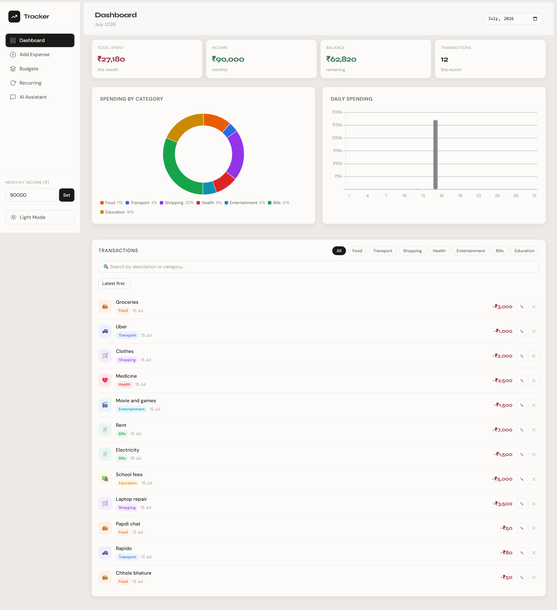
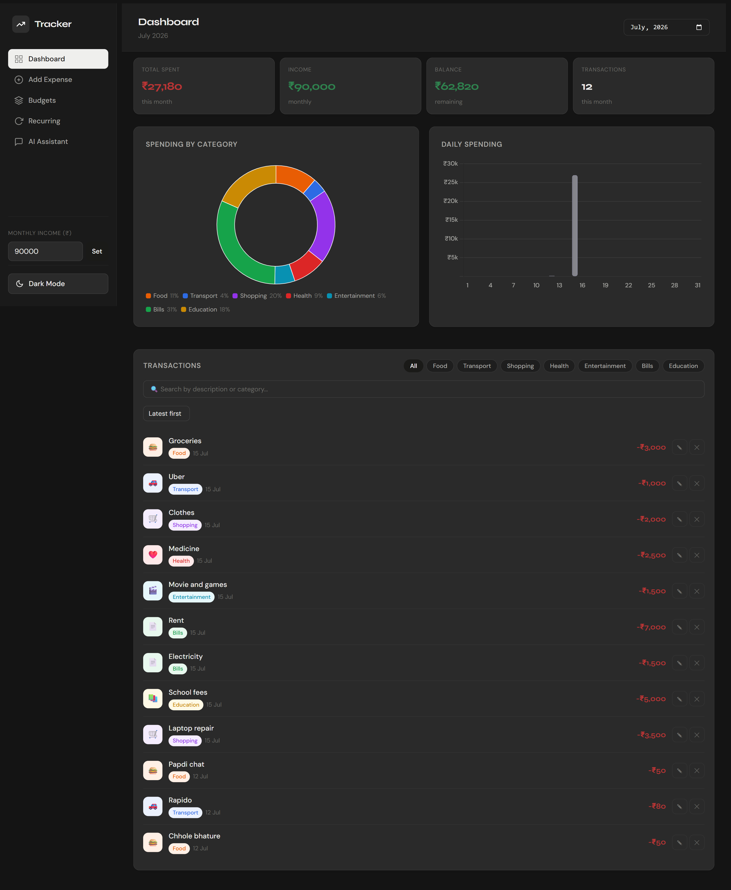
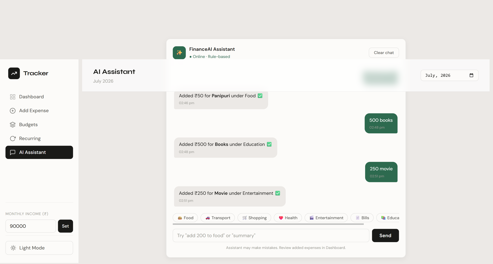
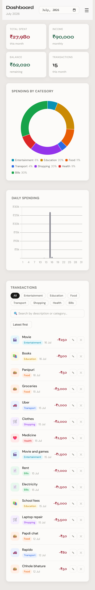

# Trackr — Expense Tracker App 💰

A clean, minimal personal finance tracker built with HTML, CSS, and JavaScript — now with an AI-powered assistant. Track your daily expenses, set category budgets, visualize spending patterns, manage recurring payments, and add expenses using natural language chat.

---

## 🖥️ Live Preview

> [Click here to view the live demo](https://trackr-expense-tracker.netlify.app/)
---

## 📸 Preview

### 🖥️ Desktop — Light Mode


### 🌙 Desktop — Dark Mode


### 🤖 AI Assistant


### 📱 Mobile

---

## ✨ Features

| Feature                    | Description                                                                                                    |
| --------------------------- | ---------------------------------------------------------------------------------------------------------------- |
| 📊 **Dashboard**            | Monthly summary with total spent, income, balance, and transaction count                                        |
| 🗓️ **Month Picker**         | Switch between any month using the month selector in the top bar to review historical spending                  |
| 🍩 **Spending Charts**      | Doughnut chart by category + daily bar chart (powered by Chart.js), updates based on selected month             |
| ➕ **Add Expenses**         | Description, amount, category, date, and recurring flag                                                         |
| 🏷️ **Category System**      | 8 pre-defined categories (Food, Transport, Shopping, Health, Entertainment, Bills, Education, Other)            |
| 🎯 **Budget Goals**         | Set monthly limits per category with live progress bars                                                         |
| 🔁 **Recurring Expenses**   | Mark expenses as monthly recurring and track total fixed costs                                                  |
| ✏️ **Edit & Delete**        | Modify any transaction via modal or remove it instantly                                                         |
| 🔍 **Search & Filter**      | Search transactions by description or category, filter by category pills, and sort by amount                   |
| 🤖 **AI Assistant**         | Chat-style tab to add expenses in natural language (e.g. "50 namkeen"), get spending summaries, and category totals |
| 🧠 **Smart Categorization** | Keyword-based matching first, with a **Groq LLM fallback** for unrecognized items — no manual tagging needed    |
| 🌗 **Dark / Light Mode**    | Toggle between themes with a single click; preference is remembered on reload                                   |
| 💾 **Persistent Storage**   | All expense data saved in `localStorage`, no database needed                                                    |
| 📱 **Responsive Design**    | Works on desktop and mobile with a collapsible sidebar                                                          |

---

## 🛠️ Tech Stack

| Technology            | Purpose                                                       |
| ---------------------- | -------------------------------------------------------------- |
| HTML5                  | Structure & markup                                            |
| CSS3                   | Styling, layout, responsive design                             |
| JavaScript (ES6+)      | App logic, localStorage, DOM manipulation, async API calls     |
| Chart.js               | Doughnut & bar charts                                          |
| Google Fonts           | DM Sans + Syne typography                                      |
| Netlify Functions      | Serverless backend to securely call the AI API                 |
| Groq API (Llama 3.1)   | LLM-powered fallback for expense categorization                |

---

## 📁 Project Structure

```
Expense-Tracker/
├── index.html                        # Main HTML file
├── style.css                         # All styles
├── scripts.js                        # App logic (expenses, budgets, charts, AI assistant)
├── netlify.toml                      # Netlify build & functions config
├── netlify/
│   └── functions/
│       └── categorize.js             # Serverless function — calls Groq API for categorization
├── Assets/
│   ├── dashboard-light.png           # Dashboard screenshot (light mode)
│   ├── dashboard-dark.png            # Dashboard screenshot (dark mode)
│   ├── ai-assistant.png              # AI Assistant chat screenshot
│   └── mobile-dashboard.png          # Mobile view screenshot
└── README.md
```

---

## 🚀 Getting Started

### 1. Clone the repository

```bash
git clone https://github.com/Sunaina55/Expense-Tracker.git
cd Expense-Tracker
```

### 2. Running without AI Assistant (simplest)

Open `index.html` directly in your browser, or use Live Server in VS Code. The dashboard, budgets, charts, and keyword-based categorization all work with no setup.

### 3. Running with AI Assistant (full setup)

The AI Assistant's Groq fallback requires a serverless function, so it needs Netlify CLI instead of a plain static server.

```bash
npm install -g netlify-cli
netlify login
netlify link
```

Create a `.env` file in the project root:

```
GROQ_API_KEY=your_groq_api_key_here
```

Then run:

```bash
netlify dev
```

This starts a local server (usually `http://localhost:8888`) with both the frontend and the AI function running together.

> ⚠️ `.env` is git-ignored — never commit your API key. On Netlify's dashboard, add `GROQ_API_KEY` under **Site configuration → Environment variables** for the live deployment.

---

## 📖 How to Use

### Adding an Expense (manual)

1. Click **Add Expense** in the sidebar
2. Fill in description, amount, category, and date
3. Optionally check **Recurring monthly** for fixed costs
4. Click **Add Expense** — it appears instantly on the dashboard

### Adding an Expense (AI Assistant)

1. Click **AI Assistant** in the sidebar
2. Type something like `"50 namkeen"` or `"add 200 to food"`
3. The assistant matches it against known keywords first; if nothing matches, it asks Groq's LLM to classify it
4. Ask things like `"how much did I spend on travel?"` or `"show summary"` for quick insights

### Setting a Budget

1. Click **Budgets** in the sidebar
2. Select a category and enter a monthly limit
3. Click **Set Budget** — a progress bar will track your spending live

### Editing or Deleting

- Click the ✎ icon on any transaction to edit amount, description, or category
- Click the ✕ icon to delete it

### Searching Transactions

- Use the search box above the transactions list to instantly filter expenses by description or category
- Combine it with the category pills and the sort dropdown (Latest first / High to Low / Low to High) for more precise results

### Viewing a Different Month

- Use the month picker in the top bar to switch the dashboard view to any month
- Metrics, charts, budget progress, and the transaction list all update to reflect the selected month

### Setting Income

- Enter your monthly income in the **sidebar bottom field** and click **Set**
- Your balance (income − spending) updates automatically

### Switching Theme

- Click the **Light Mode / Dark Mode** button at the bottom of the sidebar to toggle themes
- Your preference is saved and remembered the next time you open the app

---

## 📊 Charts

- **Spending by Category** — Doughnut chart showing percentage split across all categories for the selected month
- **Daily Spending** — Bar chart showing how much you spent each day of the selected month

---

## 🤖 How AI Categorization Works

1. **Keyword match** — checks the description against a predefined list of category keywords (fast, no network call)
2. **Category name match** — checks if a category is directly mentioned (e.g. "50 shopping")
3. **Groq LLM fallback** — if nothing matches, sends the description to a Netlify serverless function, which calls Groq's `llama-3.1-8b-instant` model to classify it
4. **Safety net** — if the AI call fails or times out, the expense is still added under "Other" rather than blocking the user

This layered approach keeps common entries instant while still handling unfamiliar items intelligently.

---

## 💾 Data Storage

All expense data is stored in your browser's `localStorage` under these keys:

| Key                  | Contents               |
| -------------------- | ----------------------- |
| `trackr_expenses_v1` | All expense entries     |
| `trackr_budgets_v1`  | Category budget limits  |
| `trackr_income_v1`   | Monthly income value    |

> ⚠️ Clearing browser data will erase all entries. No cloud sync is included. The AI Assistant only sends expense *descriptions* (not amounts or personal data) to the categorization function when the keyword match fails.

---

## 🙏 Acknowledgements

- [Chart.js](https://www.chartjs.org/) — for the beautiful charts
- [Google Fonts](https://fonts.google.com/) — DM Sans & Syne typefaces
- [Groq](https://groq.com/) — for fast LLM inference powering the AI Assistant
- [Netlify](https://www.netlify.com/) — for hosting and serverless functions

---

## 📬 Contact

**Sunaina**

- GitHub: [@Sunaina55](https://github.com/Sunaina55)

---

_Built with HTML, CSS & JS, extended with Netlify Functions and Groq for AI-powered features._