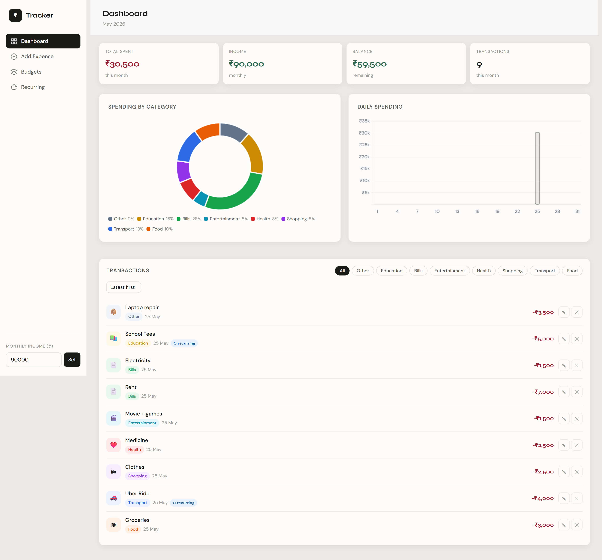
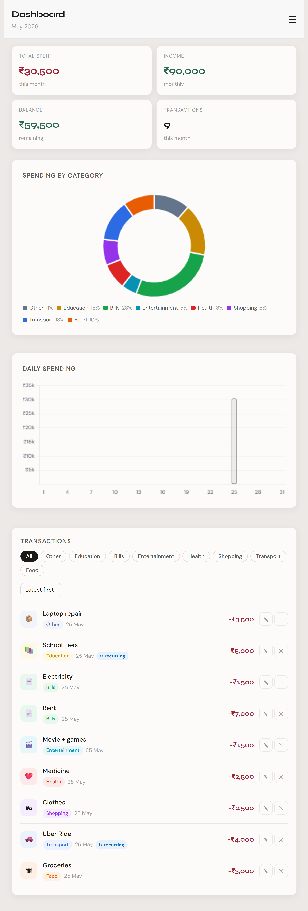

# Trackr — Expense Tracker App 💰

A clean, minimal personal finance tracker built with vanilla HTML, CSS, and JavaScript. Track your daily expenses, set category budgets, visualize spending patterns, and manage recurring payments — all stored locally in your browser.

---

## 🖥️ Live Preview

> [Click here to view the live demo](https://sunaina55.github.io/Expense-Tracker/)

The demo is published from the main branch via GitHub Pages. If the site shows an error, make sure the workflow has run successfully in the Actions tab and that GitHub Pages is enabled for the repository.

---

## 📸 Preview

### 🖥️ Desktop



### 📱 Mobile



---

## ✨ Features

| Feature                   | Description                                                                                          |
| ------------------------- | ---------------------------------------------------------------------------------------------------- |
| 📊 **Dashboard**          | Monthly summary with total spent, income, balance, and transaction count                             |
| 🗓️ **Month Picker**       | Switch between any month using the month selector in the top bar to review historical spending       |
| 🍩 **Spending Charts**    | Doughnut chart by category + daily bar chart (powered by Chart.js), updates based on selected month  |
| ➕ **Add Expenses**       | Description, amount, category, date, and recurring flag                                              |
| 🏷️ **Category System**    | 8 pre-defined categories (Food, Transport, Shopping, Health, Entertainment, Bills, Education, Other) |
| 🎯 **Budget Goals**       | Set monthly limits per category with live progress bars                                              |
| 🔁 **Recurring Expenses** | Mark expenses as monthly recurring and track total fixed costs                                       |
| ✏️ **Edit & Delete**      | Modify any transaction via modal or remove it instantly                                              |
| 🔍 **Search & Filter**    | Search transactions by description or category, filter by category pills, and sort by amount         |
| 🌗 **Dark / Light Mode**  | Toggle between themes with a single click; preference is remembered on reload                        |
| 💾 **Persistent Storage** | All data saved in `localStorage`, no backend needed                                                  |
| 📱 **Responsive Design**  | Works on desktop and mobile with a collapsible sidebar                                               |

---

## 🛠️ Tech Stack

| Technology        | Purpose                                   |
| ----------------- | ----------------------------------------- |
| HTML5             | Structure & markup                        |
| CSS3              | Styling, layout, responsive design        |
| JavaScript (ES6+) | App logic, localStorage, DOM manipulation |
| Chart.js          | Doughnut & bar charts                     |
| Google Fonts      | DM Sans + Syne typography                 |

---

## 📁 Project Structure

```
Expense-Tracker/
├── index.html          # Main HTML file
├── style.css           # All styles
├── scripts.js          # App logic (expenses, budgets, charts)
├── Assets/
│   ├── desktop-preview.png    # Desktop screenshot
│   └── mobile-preview.png     # Mobile screenshot
└── README.md
```

---

## 🚀 Getting Started

### 1. Clone the repository

```bash
git clone https://github.com/Sunaina55/Expense-Tracker.git
cd Expense-Tracker
```

### 2. Run the app

Open `index.html` directly in your browser, **or** use Live Server in VS Code:

```bash
# If you have Live Server installed
# Right-click index.html → Open with Live Server
```

No npm install, no build step — just open and use! ✅

---

## 📖 How to Use

### Adding an Expense

1. Click **Add Expense** in the sidebar
2. Fill in description, amount, category, and date
3. Optionally check **Recurring monthly** for fixed costs
4. Click **Add Expense** — it appears instantly on the dashboard

### Setting a Budget

1. Click **Budgets** in the sidebar
2. Select a category and enter a monthly limit
3. Click **Set Budget** — a progress bar will track your spending live

### Editing or Deleting

- Click the ✎ icon on any transaction to edit amount, description, or category
- Click the ✕ icon to delete it

### Searching Transactions

- Use the search box above the transactions list to instantly filter expenses by description or category
- Combine it with the category pills and the sort dropdown (Latest first / High to Low / Low to High) for more precise results

### Viewing a Different Month

- Use the month picker in the top bar to switch the dashboard view to any month
- Metrics, charts, budget progress, and the transaction list all update to reflect the selected month

### Setting Income

- Enter your monthly income in the **sidebar bottom field** and click **Set**
- Your balance (income − spending) updates automatically

### Switching Theme

- Click the **Light Mode / Dark Mode** button at the bottom of the sidebar to toggle themes
- Your preference is saved and remembered the next time you open the app

---

## 📊 Charts

- **Spending by Category** — Doughnut chart showing percentage split across all categories for the selected month
- **Daily Spending** — Bar chart showing how much you spent each day of the selected month

---

## 💾 Data Storage

All data is stored in your browser's `localStorage` under these keys:

| Key                  | Contents               |
| -------------------- | ---------------------- |
| `trackr_expenses_v1` | All expense entries    |
| `trackr_budgets_v1`  | Category budget limits |
| `trackr_income_v1`   | Monthly income value   |

> ⚠️ Clearing browser data will erase all entries. No cloud sync is included.

---

## 🙏 Acknowledgements

- [Chart.js](https://www.chartjs.org/) — for the beautiful charts
- [Google Fonts](https://fonts.google.com/) — DM Sans & Syne typefaces

---

## 📬 Contact

**Sunaina**

- GitHub: [@Sunaina55](https://github.com/Sunaina55)

---

_Made with ❤️ using HTML, CSS & JS — no frameworks, no dependencies._